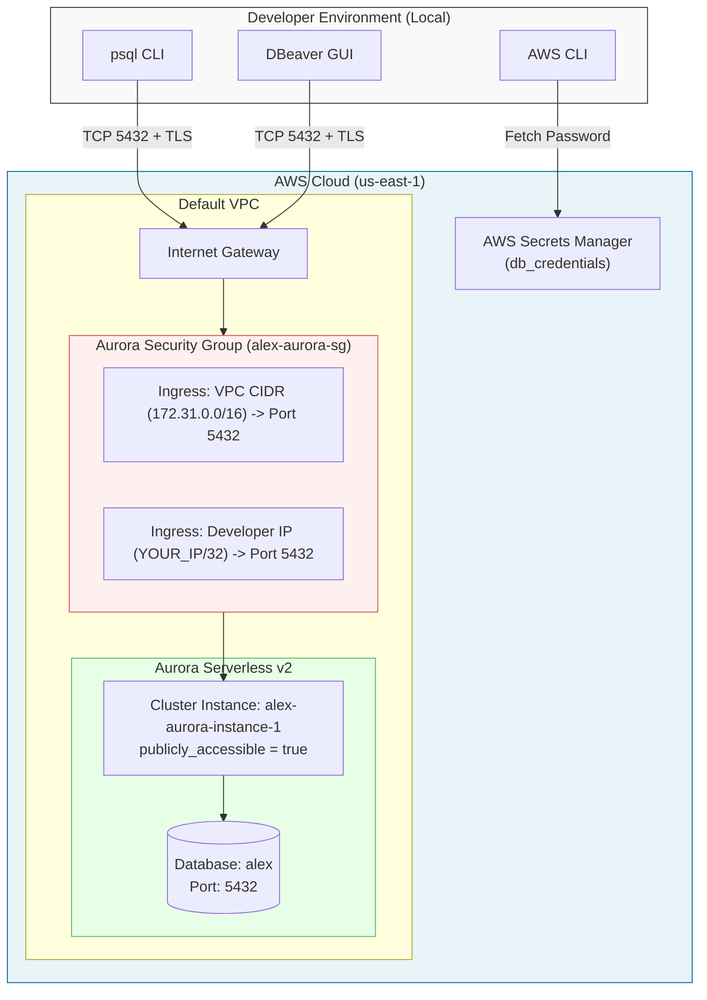

# Direct Database Access Strategy: Option B (IP-Whitelisted Security Group Direct Access)

This technical guide provides a complete, step-by-step implementation plan for **Option B: IP-Whitelisted Direct Access** to Aurora Serverless v2 PostgreSQL in Project Alex. This strategy enables developers and database administrators to connect directly to the Aurora PostgreSQL instance using native database utilities (such as `psql` CLI, DBeaver GUI, DataGrip, or pgAdmin) while maintaining strict network security via dynamic AWS Security Group IP restrictions.

---

## 1. Executive Summary & Overview

### What is Option B?

Option B enables direct TCP network connectivity to the Aurora PostgreSQL database engine on port `5432`. To keep code clean and prevent hardcoding IP addresses in Git or Terraform files, Option B uses a **Zero-Hardcoding GUI Workflow**:

1. **`publicly_accessible = true`** on the Aurora RDS cluster instance (`aws_rds_cluster_instance.aurora`).
2. **Terraform Drift Protection (`lifecycle { ignore_changes = [ingress] }`)**: Prevents Terraform or CI/CD pipelines from overwriting or deleting custom ingress rules added manually in the AWS Management Console.
3. **AWS Console "My IP" 1-Click Rule Addition**: Developers manually add or update their home/office IP using the AWS Console's auto-detecting **"My IP"** dropdown.
4. **Mandatory SSL/TLS Transport Encryption** (`sslmode=require`) to protect database credentials and query payloads in transit over the internet.

```
+------------------------+           Port 5432 (TLS)           +---------------------------------+
|  Developer Workstation  | -----------------------------------> |  AWS Internet Gateway (IGW)     |
| (psql CLI / DBeaver)   |  (whitelisted IP: e.g. 203.0.113.4)  +---------------------------------+
+------------------------+                                                     |
                                                                               v
                                                                +---------------------------------+
                                                                |  Aurora Security Group (5432)   |
                                                                | (Managed via AWS Console "My IP"|
                                                                |  + Terraform ignore_changes)    |
                                                                +---------------------------------+
                                                                               |
                                                                               v
                                                                +---------------------------------+
                                                                | Aurora Serverless v2 PostgreSQL |
                                                                |  (publicly_accessible = true)   |
                                                                +---------------------------------+
```

### When to Use Option B

| Goal | Primary Benefit |
| :--- | :--- |
| **GUI Administration** | Full feature support for visual tools (DBeaver, DataGrip, TablePlus, pgAdmin) including ER diagrams, auto-completion, and schema inspection. |
| **Fast Migration / DDL Execution** | Direct execution of multi-statement SQL migration scripts, schema dumps, and seed data loads without Data API limits. |
| **Interactive Debugging** | Low-latency line-by-line SQL execution, `EXPLAIN ANALYZE` profiling, and active connection tracking. |
| **Development Ergonomics** | Native database drivers (e.g., `psycopg2`, `asyncpg`, `sqlalchemy`) can run locally without needing an AWS IAM/Data API wrapper. |

---

## 2. Technical Architecture & Security Model

### Architecture Diagram



### Security Trade-Off Analysis

> [!IMPORTANT]
> Enabling `publicly_accessible = true` assigns a public IP address to the Aurora DB instance. Security relies entirely on AWS Security Group ingress boundaries and database password authentication.

| Security Control | Implementation | Purpose |
| :--- | :--- | :--- |
| **Network Boundary** | Security Group Ingress Rule (`/32` CIDR) | Drops all unauthorized TCP connection attempts at the AWS perimeter. |
| **Transport Security** | TLS 1.2/1.3 (`sslmode=require`) | Prevents packet sniffing and man-in-the-middle attacks across public transit. |
| **Credential Management** | AWS Secrets Manager (32-char high-entropy string) | Protects against brute-force password guessing attempts. |
| **Principle of Least Privilege** | Developer IP Whitelisting | IP addresses can be dynamically modified or revoked via Terraform / CLI at any time. |

---

## 3. Infrastructure Code Changes (Terraform)

To support Option B, we update the files in `terraform/5_database/` using the following diffs:

### 3.1 Diff for `terraform/5_database/variables.tf`

Add the `developer_ip_cidrs` variable to [terraform/5_database/variables.tf](file:///Users/aponte/personal_workspace/agent_engineering_production_udemy/projects/alex/terraform/5_database/variables.tf):

```diff
 variable "max_capacity" {
   description = "Maximum capacity for Aurora Serverless v2 (in ACUs)"
   type        = number
   default     = 2
 }
+
+variable "developer_ip_cidrs" {
+  description = "List of developer IP CIDR blocks allowed direct PostgreSQL access on port 5432 (e.g. ['203.0.113.4/32']). Leave empty to auto-detect current public IP."
+  type        = list(string)
+  default     = []
+}
```

---

### 3.2 Diff for `terraform/5_database/main.tf`

Modify [terraform/5_database/main.tf](file:///Users/aponte/personal_workspace/agent_engineering_production_udemy/projects/alex/terraform/5_database/main.tf) to:
1. Add `publicly_accessible = true` on `aws_rds_cluster_instance.aurora`.
2. Add `lifecycle { ignore_changes = [ingress] }` to `aws_security_group.aurora` so Terraform/CI will **never overwrite or delete manual rules added in the AWS GUI Console**.

```diff
 # Security group for Aurora
 resource "aws_security_group" "aurora" {
   name        = "alex-aurora-sg"
   description = "Security group for Alex Aurora cluster"
   vpc_id      = data.aws_vpc.default.id
   
   # Allow PostgreSQL access from within VPC
   ingress {
     description = "Allow internal VPC PostgreSQL access"
     from_port   = 5432
     to_port     = 5432
     protocol    = "tcp"
     cidr_blocks = [data.aws_vpc.default.cidr_block]
   }
   
   egress {
     from_port   = 0
     to_port     = 0
     protocol    = "-1"
     cidr_blocks = ["0.0.0.0/0"]
   }
   
   tags = {
     Project = "alex"
     Part    = "5"
   }
+
+  # Prevents Terraform or CI/CD runs from deleting rules added in AWS Console GUI
+  lifecycle {
+    ignore_changes = [ingress]
+  }
 }

 # Aurora Serverless v2 Instance
 resource "aws_rds_cluster_instance" "aurora" {
   identifier          = "alex-aurora-instance-1"
   cluster_identifier  = aws_rds_cluster.aurora.id
   instance_class      = "db.serverless"
   engine              = aws_rds_cluster.aurora.engine
   engine_version      = aws_rds_cluster.aurora.engine_version
+  publicly_accessible = true
```

---

### 3.3 Deploy Infrastructure Changes

Apply the Terraform changes from your project root:

```bash
cd terraform/5_database

# Review execution plan
terraform plan

# Apply infrastructure changes
terraform apply -auto-approve
```

---

### 3.4 Adding Your IP via AWS Console GUI (Zero-Hardcoding 1-Click Workflow)

Once Terraform deploys `publicly_accessible = true` and `ignore_changes = [ingress]`, add your current laptop IP in the AWS GUI Console without hardcoding it in Git or code files:

1. Open **AWS Management Console** → navigate to **VPC** (or **EC2**) → **Security Groups**.
2. Click on **`alex-aurora-sg`**.
3. Select the **Inbound rules** tab → click **Edit inbound rules**.
4. Click **Add rule**:
   - **Type**: `PostgreSQL` (Port 5432)
   - **Source**: Select **"My IP"** from the dropdown *(AWS Console automatically detects your public IP address and appends `/32`!)*
   - **Description**: `Developer Workstation Direct Access`
5. Click **Save rules**.

> [!TIP]
> **Dynamic IP / Travel Convenience**: Whenever your ISP updates your public IP address or you connect from a new network (home, office, coffee shop), simply repeat Step 3.4 to update your rule. Because of `ignore_changes = [ingress]`, Terraform and CI/CD runs will **never delete your GUI rule**.

---

## 4. Retrieving Credentials from AWS Secrets Manager

The database credentials (username and auto-generated random password) are securely stored in AWS Secrets Manager.

### 4.1 Shell Command to Extract Database Password

Run the following command using AWS CLI and `jq` to extract the password directly into your shell environment:

```bash
# 1. Obtain the Secret ARN from Terraform Output (or AWS CLI)
SECRET_ARN=$(aws terraform output -raw aurora_secret_arn 2>/dev/null || \
  aws secretsmanager list-secrets --query "SecretList[?contains(Name, 'alex-aurora-credentials')].ARN | [0]" --output text)

# 2. Retrieve Username and Password
DB_USER=$(aws secretsmanager get-secret-value --secret-id "$SECRET_ARN" --query SecretString --output text | jq -r .username)
DB_PASS=$(aws secretsmanager get-secret-value --secret-id "$SECRET_ARN" --query SecretString --output text | jq -r .password)
DB_HOST=$(aws rds describe-db-clusters --db-cluster-identifier alex-aurora-cluster --query "DBClusters[0].Endpoint" --output text)

# 3. Export variables for shell session
export PGHOST="$DB_HOST"
export PGPORT="5432"
export PGDATABASE="alex"
export PGUSER="$DB_USER"
export PGPASSWORD="$DB_PASS"
export PGSSLMODE="require"

# 4. Verify variables were set
echo "Connecting to Host: $PGHOST as User: $PGUSER"
```

---

## 5. Connection Guide: `psql` CLI

### 5.1 Prerequisites

Ensure PostgreSQL CLI client is installed on your local machine:

```bash
# macOS (Homebrew)
brew install postgresql@15

# Ubuntu/Debian
sudo apt-get install -y postgresql-client
```

### 5.2 Connecting via Standard Connection String

With the environment variables set from Section 4, execute `psql`:

```bash
psql "host=${PGHOST} port=5432 dbname=alex user=${PGUSER} sslmode=require"
```

Alternatively, use environment variables directly:

```bash
psql
```

### 5.3 Verification Queries

Once connected, run the following commands to test database functionality:

```sql
-- Check database version and SSL connection status
SELECT version();
SELECT ssl_is_used(), ssl_version(), ssl_cipher();

-- List all tables in current schema
\dt

-- Query seeded instruments
SELECT symbol, name, instrument_type, current_price FROM instruments LIMIT 5;

-- Exit psql session
\q
```

Expected Output:

```
 ssl_is_used | ssl_version |        ssl_cipher        
-------------+-------------+--------------------------
 t           | TLSv1.3     | TLS_AES_256_GCM_SHA384
(1 row)
```

---

## 6. Connection Guide: DBeaver GUI

[DBeaver](https://dbeaver.io/) is a free, cross-platform universal database tool that provides a rich visual SQL editor, schema browser, and ER diagram viewer.

### Step-by-Step DBeaver Setup

```
 +-----------------------------------------------------------------------------+
 |                         DBeaver Connection Settings                         |
 +-----------------------------------------------------------------------------+
 |  Driver: PostgreSQL                                                         |
 |  Host:   alex-aurora-cluster.cluster-xxxxxx.us-east-1.rds.amazonaws.com     |
 |  Port:   5432                                                               |
 |  Database: alex                                                             |
 |  Authentication: Database Native                                            |
 |  Username: alexadmin                                                        |
 |  Password: [Pasted from Secrets Manager]                                    |
 |                                                                             |
 |  [ SSL Tab ] -> Use SSL: checked | SSL Mode: require                        |
 +-----------------------------------------------------------------------------+
```

1. **Launch DBeaver** and click **Database** → **New Database Connection** (or press `Ctrl+N` / `Cmd+N`).
2. Select **PostgreSQL** from the driver list and click **Next**.
3. In the **Main** tab, enter connection details:
   - **Host**: Your Aurora Endpoint (e.g., `alex-aurora-cluster.cluster-c123456789.us-east-1.rds.amazonaws.com`).
   - **Port**: `5432`.
   - **Database**: `alex`.
   - **Authentication**: `Database Native`.
   - **Username**: `alexadmin`.
   - **Password**: Paste the 32-character password retrieved from AWS Secrets Manager in Section 4.
4. Switch to the **SSL** tab:
   - Check **Use SSL**.
   - Set **SSL Mode** to `require` or `verify-full`.
5. Click **Test Connection ...**:
   - If prompted to download PostgreSQL JDBC drivers, click **Download**.
   - You should see a success message: `Connected! PostgreSQL 15.x ...`.
6. Click **Finish** to save the connection.

> [!TIP]
> You can now view table schemas, execute migrations, visually edit records, and generate ER diagrams directly in DBeaver!

---

## 7. Security Best Practices & Maintenance Rules

1. **Keep IP Whitelist Minimal (`/32`)**:
   - Never use `0.0.0.0/0` in Security Group ingress rules. Always restrict access to exact `/32` IPv4 host addresses.
   
2. **Handle Dynamic Developer IPs**:
   - If your home/office ISP changes your public IP address, update the whitelist by running:
     ```bash
     cd terraform/5_database
     terraform apply -auto-approve
     ```
     This auto-detects your new external IP address and updates the Security Group rule in seconds without downtime.

3. **Enforce SSL/TLS Connections**:
   - Always pass `sslmode=require` in connection strings and enable SSL in GUI clients to prevent unencrypted traffic over the public internet.

4. **Temporary Access Lifecycle**:
   - When active development or debugging is finished, you can temporarily revoke external access by modifying `developer_ip_cidrs = ["0.0.0.0/32"]` or setting `publicly_accessible = false` in `terraform/5_database/main.tf` and applying Terraform.

---

## 8. Summary Checklist & Next Steps

- [x] Updated `variables.tf` with `developer_ip_cidrs`.
- [x] Updated `main.tf` with `data "http" "my_ip"`, dynamic Security Group ingress, and `publicly_accessible = true`.
- [x] Ran `terraform apply` to deploy updated infrastructure.
- [x] Retrieved credentials via AWS Secrets Manager CLI command.
- [x] Verified direct terminal access using `psql`.
- [x] Connected successfully using DBeaver GUI with TLS `sslmode=require`.

You now have a fully operational Option B direct database access setup for Project Alex! 🚀
